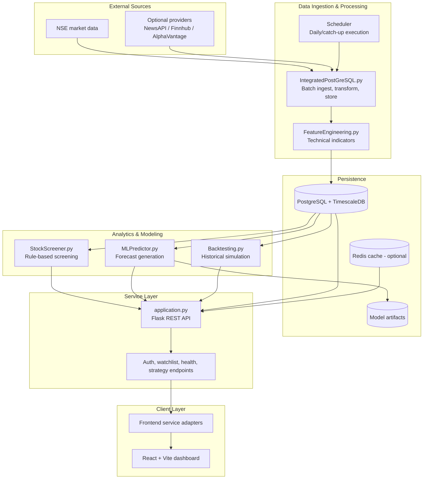

# Artha Drishti

Artha Drishti is an end-to-end stock market intelligence platform that unifies data ingestion, quantitative screening, machine-learning forecasting, and strategy backtesting in one product.

## Table of Contents
- [Overview](#overview)
- [Core Capabilities](#core-capabilities)
- [Technology Stack](#technology-stack)
- [Application Architecture](#application-architecture)
- [Getting Started](#getting-started)
- [Configuration](#configuration)
- [Key API Endpoints](#key-api-endpoints)
- [Repository Structure](#repository-structure)
- [Documentation](#documentation)
- [License](#license)

## Overview

The platform combines a React dashboard with a Flask API and a modular analytics engine. It is designed for practitioners who need a single workflow for market discovery, prediction, and historical validation.

## Core Capabilities

- Multi-strategy stock screening (Momentum, Piotroski, Swing, Breakout, Value, and Custom rules)
- ML-driven forecasting using sequence models with attention
- Strategy backtesting with standardized performance outputs
- Automated data pipeline backed by PostgreSQL/TimescaleDB
- Watchlist and dashboard views for operational decision support

## Technology Stack

- **Frontend:** React 18, Vite
- **Backend:** Flask, APScheduler, Python analytics services
- **Data Layer:** PostgreSQL 14+, TimescaleDB, optional Redis cache
- **ML Layer:** PyTorch-based forecasting models

## Application Architecture



## Getting Started

### 1) Start the backend

```bash
cd backend
python -m venv venv
# Windows
venv\Scripts\activate
# Linux/macOS
source venv/bin/activate
pip install -r requirements.txt
copy .env.example .env
python application.py
```

### 2) Start the frontend

```bash
cd frontend
npm install
npm run dev
```

Open: `http://localhost:5173`

Optional health check: `GET http://localhost:5000/api/health`

## Configuration

### Backend (`backend/.env`)

Create from `backend/.env.example` and configure key values:

- `DATABASE_URL`
- `APP_HOST`, `APP_PORT`, `APP_ENV`, `APP_DEBUG`, `APP_USE_RELOADER`, `APP_THREADED`
- `SECRET_KEY`, `JWT_SECRET_KEY`
- `CORS_ORIGINS`
- `NEWSAPI_KEY`, `FINNHUB_KEY`, `ALPHAVANTAGE_KEY` (optional)
- `SCHEDULER_ENABLED`, `SCHEDULER_HOUR`, `SCHEDULER_MINUTE`, `SCHEDULER_AUTO_START`
- `SCHEDULER_AUTO_CATCHUP`, `SCHEDULER_AUTO_TRAIN`, `SCHEDULER_IN_WEB_WORKER`

### Frontend (`frontend/.env.local`)

Create from `frontend/.env.example`:

- `VITE_API_BASE_URL` (optional; leave empty for same-origin proxy)
- `VITE_GOOGLE_CLIENT_ID` (optional; enables Google OAuth)

## Key API Endpoints

| Endpoint | Method | Purpose |
|---|---|---|
| `/api/health` | GET | Service health |
| `/api/stocks` | GET | Latest stock snapshot |
| `/api/history/<ticker>` | GET | Historical series for a ticker |
| `/api/screen/momentum` | POST | Momentum screen |
| `/api/screen/piotroski` | POST | Piotroski F-score screen |
| `/api/predict/<ticker>` | POST | Generate model forecast |
| `/api/train/<ticker>` | POST | Train/update model |
| `/api/backtest/<strategy>` | POST | Run strategy backtest |

## Repository Structure

```text
Artha-Drishti/
├── backend/                    # Flask API, data pipeline, ML, screening, backtesting
│   ├── application.py
│   ├── IntegratedPostGreSQL.py
│   ├── MLPredictor.py
│   ├── StockScreener.py
│   ├── FeatureEngineering.py
│   ├── Backtesting.py
│   └── README.md
├── frontend/                   # React dashboard
│   ├── src/
│   ├── package.json
│   └── README.md
└── docs/                       # GitHub Pages site assets
```

## Documentation

- Backend guide: [`backend/README.md`](backend/README.md)
- Frontend guide: [`frontend/README.md`](frontend/README.md)
- Project pages assets: [`docs/`](docs/)

## License

MIT License
